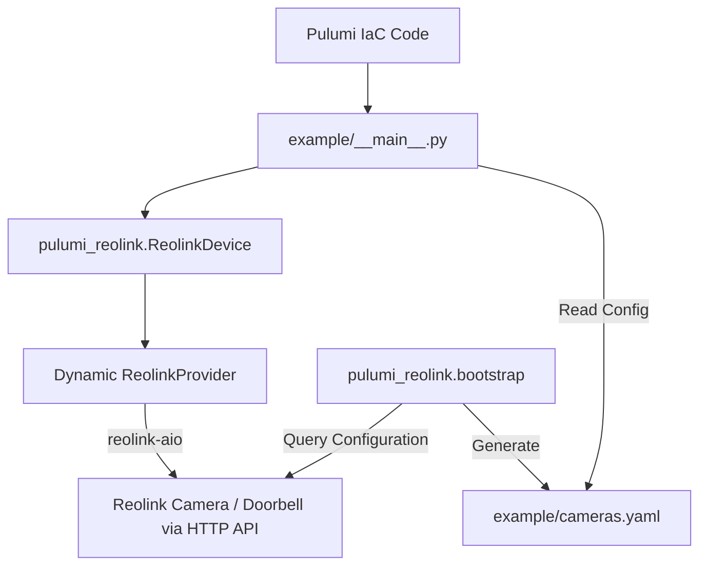

# Technical Specification: pulumi-reolink

A reusable Pulumi package and CLI utility to configure and back up Reolink camera settings locally without depending on Home Assistant, publishable to PyPI.

---

## 1. Architectural Overview

The solution is packaged as a reusable Python library containing a **Pulumi Dynamic Provider**. It connects directly to Reolink cameras/doorbells on the local network using the [`reolink-aio`](https://github.com/starkillerOG/reolink-aio) Python library (the same library that powers Home Assistant's official Reolink integration).

### Data Flow



---

## 2. Limitations & Out-of-Scope Configurations

To prevent network lockouts and state desynchronization, the following operations are explicitly designated as **out-of-scope** and must be managed out-of-band:

* **Initial Network Onboarding:** Factory-reset cameras or new cameras must be joined to the network and configured with their initial admin credentials using the official Reolink app/client before Pulumi can manage them.
* **Active Network Settings:** Changing the active Wi-Fi SSID, Wi-Fi password, or subnet configurations via Pulumi is prohibited. Changing these drops the camera's connection mid-transaction, causing Pulumi to time out and enter an inconsistent state.
* **Admin Password Rotation:** Admin passwords used to connect to the cameras should be updated out-of-band. Managing password rotation via IaC carries a high risk of locking the provider out of the device if an update fails.
* **Firmware Lifecycles:** Flashing firmware is a long-running blocking operation that disrupts network connectivity and will not be supported.
* **Battery-Powered Cameras:** Battery-powered cameras (e.g., Argus series) sleep to conserve power, disabling their local HTTP APIs. Only plugged-in (PoE or DC-powered) cameras and doorbells are supported.

---

## 3. Component Design & Repository Layout

### 3.1. Repository Layout
To support publishing to PyPI, the repository will follow the standard Python packaging structure:

```
pulumi-reolink/
├── pyproject.toml              # Build backend configuration, dependencies, and QA configs
├── Justfile                    # Developer task runner (just validate)
├── spec.md                     # Technical specification
├── README.md                   # Package documentation
│
├── pulumi_reolink/             # The published Python library
│   ├── __init__.py             # Exports ReolinkDevice and bootstrap utility
│   ├── provider.py             # Custom Pulumi Dynamic Provider logic
│   └── bootstrap.py            # CLI script to query settings and generate YAML
│
├── tests/                      # Unit tests (Mock-based, 90%+ coverage target)
│
└── example/                    # Standard Pulumi project to run/test configuration
    ├── Pulumi.yaml
    ├── __main__.py             # Loops through cameras.yaml to instantiate ReolinkDevice
    └── cameras.yaml
```

### 3.2. The `ReolinkDevice` Resource

To keep the provider future-proof and model-independent, we will use a **Dynamic Settings Mapper** rather than hardcoding every single property into our Pulumi schema. 

#### Inputs
* `host` (string): The IP address or hostname of the camera.
* `port` (int, optional): The HTTP/HTTPS port (default: `80` / `443`).
* `username` (string): Admin username.
* `password` (string, secret): Admin password.
* `settings` (dict): A key-value dictionary representing the desired camera configuration.

#### Dynamic Settings Mapping & Translation Layer
To ensure user configurations are stable and protected from API updates, the custom dynamic provider will use a **Hybrid Translation Layer**:

1. **Translation Mapping:** The provider will maintain a `SETTING_ALIASES` mapping dictionary in `pulumi_reolink/provider.py`. This abstracts common configuration parameters into stable IaC property names, for example:
   ```python
   SETTING_ALIASES = {
       "siren_volume": "siren_sound_volume",
       "status_led": "status_led_state",
   }
   ```
   If Reolink or the client library changes their API names, only the provider mapping changes; the user's configuration remains completely unaffected.
2. **Dynamic Fallback:** For settings not specified in the translation map, the provider will fall back to dynamic reflection. It will inspect the `reolink-aio` `Host` object at runtime for a corresponding property or setter matching the configuration key.
3. **Validation:** If a setting is specified in IaC but not supported by that specific camera model, Pulumi will fail the deployment with a clear explanation (preventing silent failures).

---

### 3.3. Bootstrapping/Importing Existing Configuration

To import existing cameras into IaC, we provide a CLI script (`pulumi_reolink/bootstrap.py`) that reads the settings directly from your cameras and writes the YAML configuration.

#### Bootstrap Workflow:
1. Run the interactive bootstrap tool:
   ```bash
   python -m pulumi_reolink.bootstrap
   ```
2. The script prompts you for:
   - **Camera Name:** (e.g., `front-doorbell`)
   - **Host/IP:** (e.g., `192.168.1.50`)
   - **Username:** (e.g., `admin`)
   - **Password:** (Used only to connect once; *never* stored in plaintext)
   - **Secret Config Key:** (e.g., `front-doorbell-password`)
3. The script connects to the camera, queries all current settings and capabilities via `reolink-aio`, and appends the configuration to `example/cameras.yaml` using the designated `password_key`.
4. It outputs the exact command to encrypt the password locally in Pulumi:
   ```bash
   pulumi config set --secret front-doorbell-password "<password>"
   ```
5. At runtime, the `ReolinkDevice` resource resolves the actual password by calling `pulumi.Config().require_secret(password_key)`, which decrypts the value from the stack's encrypted configuration. The plaintext password is never written to disk or Pulumi state; only the ciphertext lives in `Pulumi.<stack>.yaml`.

---

### 3.4. Example Workflows & Usage

#### Secrets Configuration
To secure camera passwords:
1. Define a reference key in `cameras.yaml` (e.g., `password_key: "front-doorbell-password"`).
2. Save the password securely as an encrypted Pulumi configuration parameter:
   ```bash
   pulumi config set --secret front-doorbell-password "YourSuperSecretPassword"
   ```
   This encrypts the password and writes the ciphertext to `Pulumi.dev.yaml`.

#### Changing Settings
To update configuration (e.g., changing `status_led` from `"on"` to `"off"`):
1. Open `example/cameras.yaml` and modify the setting:
   ```yaml
   cameras:
     - name: front-doorbell
       host: 192.168.1.50
       username: admin
       password_key: "front-doorbell-password"
       settings:
         status_led: "off"  # Changed from "on"
   ```
2. Preview the changes:
   ```bash
   pulumi preview
   ```
3. Deploy the changes:
   ```bash
   pulumi up
   ```

#### Drift Detection
If settings are changed out-of-band via the Reolink phone/desktop app:
1. Run a refresh to detect drift and update the local Pulumi state:
   ```bash
   pulumi refresh
   ```
2. Re-apply the desired state from code:
   ```bash
   pulumi up
   ```


## 4. Development & Quality Assurance Standards

To ensure high-quality and maintainable code, we will enforce strict linting, formatting, type checking, and unit testing.

### 4.1. Toolchain
* **Linting & Formatting:** `ruff` (consolidates linting and formatting).
* **Type Checking:** `mypy` for static type safety.
* **Testing:** `pytest` with `pytest-cov` to ensure 90%+ test coverage.
* **Task Runner:** `just` (configured via a `Justfile`) to run validation checks.

### 4.2. Verification & Validation Rules
Before any commit is accepted, the project must pass the following validation pipeline (configured in `Justfile` and executed via `just validate`):
1. **Formatting check:** `ruff format --check .`
2. **Linter check:** `ruff check .`
3. **Type check:** `mypy .`
4. **Unit tests:** `pytest --cov=pulumi_reolink --cov-fail-under=90`

### 4.3. Test Strategy
We will write unit tests using `pytest` and mock the Reolink HTTP API responses / `reolink-aio` library. This ensures tests run quickly, deterministically, and without requiring physical camera access.

The `bootstrap.py` CLI collects input interactively, so its prompting logic will be isolated from its I/O: the interactive loop will call a testable function accepting injected input values (or `unittest.mock.patch` on the prompt calls) rather than reading from `stdin` directly, allowing unit tests to drive it with parameterized fixtures and assert on the resulting `cameras.yaml` output without any manual interaction.

---

## 5. Verification Plan

### Automated Verification
* Run `just validate` to verify syntax, style, typing, and 90%+ test coverage.

### Manual Verification
* Run the bootstrap script against a physical camera to verify it can extract settings and write `cameras.yaml`.
* Run `pulumi preview` and `pulumi up` to confirm the provider successfully connects to the camera, identifies drift when a setting is manually changed, and corrects it.

---

## 6. Architectural Alternatives Considered

### 6.1. Using a Generic Pulumi REST/HTTP Provider
We considered using a generic community REST API provider (e.g., `pulumiverse/api` or `pulumi/http`) to interact with the cameras' HTTP endpoint. This was rejected due to:

1. **Stateful Session Authentication:** Reolink's API is local-network JSON-RPC over HTTP, requiring a stateful login. You must request a session token via a `Login` command, append this dynamic token to the URL query parameters of all subsequent commands, and eventually run a `Logout` command to avoid hitting camera session limit locks. Generic REST providers assume stateless tokens or static headers, making them unable to orchestrate this session sequence.
2. **RPC Structure:** Reolink utilizes a single endpoint `POST /cgi-bin/api.cgi` with command payloads in the request body, rather than RESTful paths (e.g., `PUT /settings/...`). Generic REST providers map CRUD operations to distinct paths and methods, which does not fit this architecture.
3. **Data Type Quirks:** Camera-native values use C-style integers (e.g., `0`/`1` for booleans or specific enum numbers) that differ across firmware versions. A generic provider would expose these raw types, whereas the custom dynamic provider leverages `reolink-aio` to sanitize these values into clean types.
